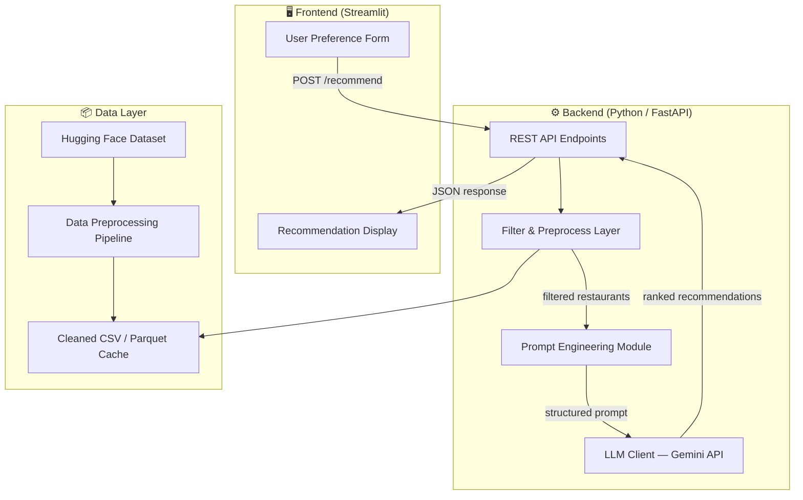
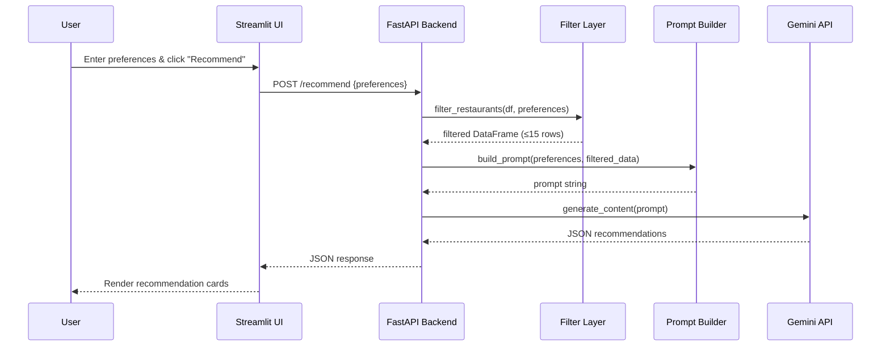

# Architecture — AI-Powered Restaurant Recommendation System

## 1. Overview

This document describes the end-to-end architecture for building an AI-powered restaurant recommendation system inspired by Zomato. The system ingests the [Zomato dataset from Hugging Face](https://huggingface.co/datasets/ManikaSaini/zomato-restaurant-recommendation), filters restaurants against user preferences, and leverages a Large Language Model (LLM) to generate ranked, human-readable recommendations.

---

## 2. High-Level Architecture Diagram



---

## 3. Technology Stack

| Layer | Technology | Rationale |
|---|---|---|
| **Language** | Python 3.11+ | Rich ML/AI ecosystem, rapid prototyping |
| **Web Framework** | FastAPI | Async support, auto-generated OpenAPI docs |
| **Frontend / UI** | Streamlit | Quick interactive dashboards, zero JS needed |
| **Dataset Source** | Hugging Face `datasets` library | Direct programmatic access to the Zomato dataset |
| **Data Processing** | Pandas | Flexible filtering, aggregation, and cleaning |
| **LLM Provider** | Google Gemini API (`google-genai` SDK) | Strong reasoning, generous free tier |
| **Caching** | Local Parquet file | Avoid re-downloading & re-processing on every run |
| **Dependency Mgmt** | `requirements.txt` + `venv` | Standard Python tooling |
| **Version Control** | Git | Standard SCM |

---

## 4. Project Structure

```
NextLeap/
├── problemStatement.md        # Problem definition
├── architecture.md            # This document
├── requirements.txt           # Python dependencies
├── .env                       # API keys (GEMINI_API_KEY) — git-ignored
├── .gitignore
│
├── data/
│   ├── raw/                   # Raw dataset cache from Hugging Face
│   └── processed/
│       └── restaurants.parquet  # Cleaned & enriched dataset
│
├── src/
│   ├── __init__.py
│   ├── config.py              # App settings, env var loading
│   ├── data_ingestion.py      # Download, clean, cache the dataset
│   ├── filters.py             # User-preference-based filtering logic
│   ├── prompt_builder.py      # Prompt engineering for the LLM
│   ├── llm_client.py          # Gemini API integration
│   └── models.py              # Pydantic request/response schemas
│
├── api/
│   ├── __init__.py
│   └── main.py                # FastAPI app & route definitions
│
├── ui/
│   └── app.py                 # Streamlit frontend
│
└── tests/
    ├── test_filters.py
    ├── test_prompt_builder.py
    └── test_llm_client.py
```

---

## 5. Component Details

### 5.1 Data Ingestion (`src/data_ingestion.py`)

**Responsibility:** Download the Zomato dataset once, clean it, and persist a processed copy.

| Step | Detail |
|---|---|
| **Download** | Use `datasets.load_dataset("ManikaSaini/zomato-restaurant-recommendation")` |
| **Select Columns** | Keep: `name`, `location`, `cuisines`, `average_cost_for_two`, `aggregate_rating`, `votes`, `has_online_delivery`, `has_table_booking` |
| **Clean** | Drop rows with missing `name` / `rating`; normalize cuisine strings to lowercase; map cost to budget buckets (low / medium / high) |
| **Persist** | Save to `data/processed/restaurants.parquet` for fast reload |

### 5.2 Filtering Layer (`src/filters.py`)

**Responsibility:** Narrow down the full dataset to a shortlist of candidates that match user preferences.

```python
def filter_restaurants(
    df: pd.DataFrame,
    location: str | None,
    budget: str | None,        # "low" | "medium" | "high"
    cuisine: str | None,
    min_rating: float = 0.0,
) -> pd.DataFrame:
    ...
```

**Filtering strategy:**
1. **Location** — case-insensitive substring match on the `location` column.
2. **Budget** — map `average_cost_for_two` into buckets and filter.
3. **Cuisine** — case-insensitive substring match against the comma-separated `cuisines` column.
4. **Rating** — `aggregate_rating >= min_rating`.
5. **Limit** — return the top 15 results sorted by rating (descending) to keep the LLM prompt focused.

### 5.3 Prompt Engineering (`src/prompt_builder.py`)

**Responsibility:** Build a structured prompt that provides the LLM with context and clear instructions.

**Prompt template:**

```text
You are a helpful restaurant recommendation assistant.

A user is looking for restaurants with the following preferences:
- Location: {location}
- Budget: {budget}
- Cuisine: {cuisine}
- Minimum Rating: {min_rating}
- Additional Preferences: {additional_prefs}

Here are the matching restaurants from our database:

{formatted_restaurant_table}

Based on the above data and the user's preferences, please:
1. Rank the top 5 restaurants from best to worst fit.
2. For each restaurant, explain WHY it is a good match.
3. Provide a brief overall summary of your recommendations.

Respond in valid JSON with the following structure:
{
  "recommendations": [
    {
      "rank": 1,
      "name": "...",
      "cuisine": "...",
      "rating": ...,
      "estimated_cost_for_two": ...,
      "explanation": "..."
    }
  ],
  "summary": "..."
}
```

### 5.4 LLM Client (`src/llm_client.py`)

**Responsibility:** Send the prompt to the Gemini API and parse the structured JSON response.

| Concern | Approach |
|---|---|
| **SDK** | `google-genai` Python SDK |
| **Model** | `gemini-2.0-flash` (fast, cost-effective) |
| **Structured Output** | Request JSON mode; parse with Pydantic `RecommendationResponse` model |
| **Error Handling** | Retry with exponential backoff (max 3 attempts); graceful fallback message on failure |
| **Token Budget** | Keep prompt under ~4 000 tokens by limiting to 15 candidate restaurants |

### 5.5 API Layer (`api/main.py`)

**Endpoints:**

| Method | Path | Description |
|---|---|---|
| `GET` | `/health` | Health check |
| `POST` | `/recommend` | Accept user preferences, return ranked recommendations |
| `GET` | `/locations` | List distinct locations in the dataset |
| `GET` | `/cuisines` | List distinct cuisines in the dataset |

**Request schema (`POST /recommend`):**

```json
{
  "location": "Bangalore",
  "budget": "medium",
  "cuisine": "Italian",
  "min_rating": 3.5,
  "additional_preferences": "family-friendly"
}
```

**Response schema:**

```json
{
  "recommendations": [
    {
      "rank": 1,
      "name": "Trattoria",
      "cuisine": "Italian, Continental",
      "rating": 4.5,
      "estimated_cost_for_two": 1200,
      "explanation": "Top-rated Italian restaurant in Bangalore with a cozy family atmosphere..."
    }
  ],
  "summary": "Based on your preferences, here are the best Italian restaurants in Bangalore within a medium budget..."
}
```

### 5.6 Frontend (`ui/app.py`)

**Streamlit application with the following sections:**

1. **Sidebar — Preference Form**
   - Dropdown: Location (populated from `/locations`)
   - Radio buttons: Budget (Low / Medium / High)
   - Dropdown: Cuisine (populated from `/cuisines`)
   - Slider: Minimum Rating (0.0 – 5.0)
   - Text input: Additional preferences
   - Submit button

2. **Main Area — Results**
   - Animated loading spinner while LLM processes
   - Cards for each recommended restaurant showing name, cuisine, rating, cost, and AI explanation
   - Summary section at the bottom

---

## 6. Data Flow (Sequence)



---

## 7. Environment & Configuration

| Variable | Purpose | Example |
|---|---|---|
| `GEMINI_API_KEY` | Google Gemini API authentication | `AIza...` |
| `DATA_PATH` | Path to processed dataset | `data/processed/restaurants.parquet` |
| `LLM_MODEL` | Model identifier | `gemini-2.0-flash` |
| `MAX_CANDIDATES` | Max restaurants to pass to LLM | `15` |
| `API_PORT` | Port for FastAPI server | `8000` |
| `STREAMLIT_PORT` | Port for Streamlit UI | `8501` |

All secrets are loaded from a `.env` file using `python-dotenv`. The `.env` file is listed in `.gitignore`.

---

## 8. Key Dependencies

```txt
fastapi>=0.115
uvicorn>=0.30
streamlit>=1.38
pandas>=2.2
datasets>=3.0          # Hugging Face datasets
google-genai>=1.0      # Gemini API SDK
pydantic>=2.9
python-dotenv>=1.0
httpx>=0.27            # For Streamlit → FastAPI calls
pyarrow>=17.0          # Parquet support
```

---

## 9. Error Handling & Edge Cases

| Scenario | Handling |
|---|---|
| No restaurants match filters | Return a friendly message: "No restaurants found. Try broadening your search." |
| LLM API failure / timeout | Retry 3× with backoff; on final failure, return filtered data without AI ranking |
| Dataset unavailable on HF | Cache processed Parquet locally; fail gracefully with a clear error |
| Malformed LLM JSON response | Attempt `json.loads` with fallback regex extraction; log the raw response for debugging |
| Empty or invalid user input | Validate with Pydantic; return `422` with descriptive error messages |

---

## 10. Future Enhancements

- **Semantic Search**: Embed restaurant descriptions with a sentence-transformer and use cosine similarity for more nuanced matching.
- **User Profiles**: Store past preferences and order history to personalize recommendations over time.
- **Review Summarization**: Feed user reviews into the LLM for richer explanations.
- **Conversational Interface**: Add multi-turn chat so users can refine recommendations ("show me cheaper options").
- **Deployment**: Containerize with Docker; deploy the API on Cloud Run and the UI on Streamlit Cloud.

---

## 11. Getting Started (Quick Reference)

```bash
# 1. Clone & set up
cd NextLeap
python -m venv .venv && source .venv/bin/activate
pip install -r requirements.txt

# 2. Configure
cp .env.example .env    # Add your GEMINI_API_KEY

# 3. Ingest data
python -m src.data_ingestion

# 4. Start the API
uvicorn api.main:app --reload --port 8000

# 5. Start the UI (in a separate terminal)
streamlit run ui/app.py --server.port 8501
```
