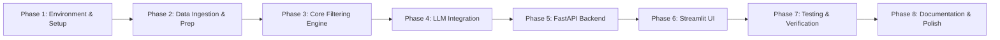

# Implementation Plan — AI-Powered Restaurant Recommendation System

This document outlines a phase-wise, step-by-step roadmap for building and deploying the AI-Powered Restaurant Recommendation System based on [architecture.md](file:///Users/shashikiran/Desktop/NextLeap%20/architecture.md) and [problemStatement.md](file:///Users/shashikiran/Desktop/NextLeap%20/problemStatement.md).

---

## Overview of Phases

---

## Phase 1: Environment Setup & Project Scaffolding

### Objective
Initialize the repository structure, virtual environment, and dependency management.

### Tasks
- [x] Create project directory hierarchy:
  - `data/raw/`, `data/processed/`
  - `src/`
  - `api/`
  - `ui/`
  - `tests/`
- [x] Create and configure `.gitignore` (ignore `.venv`, `__pycache__`, `.env`, `data/raw/`, `.DS_Store`).
- [x] Create `requirements.txt` with required dependencies:
  - `fastapi`, `uvicorn`, `streamlit`, `pandas`, `datasets`, `google-genai`, `pydantic`, `python-dotenv`, `httpx`, `pyarrow`, `pytest`
- [x] Set up `.env.example` and local `.env` with configuration keys:
  - `GEMINI_API_KEY`
  - `DATA_PATH=data/processed/restaurants.parquet`
  - `LLM_MODEL=gemini-2.0-flash`
  - `MAX_CANDIDATES=15`
- [x] Create `src/config.py` using `pydantic-settings` or `python-dotenv` for typed configuration loading.

### Deliverables
- ✅ Working virtual environment with all dependencies installed.
- ✅ Verified configuration loading via `src/config.py`.

---

## Phase 2: Data Ingestion & Preprocessing Pipeline

### Objective
Download, inspect, clean, and cache the Hugging Face Zomato dataset into a high-performance local format (Parquet).

### Tasks
- [x] Create `src/data_ingestion.py`:
  - Implement dataset download using `datasets.load_dataset("ManikaSaini/zomato-restaurant-recommendation")`.
  - Extract and rename relevant fields:
    - `name`, `location`, `cuisines`, `average_cost_for_two`, `aggregate_rating`, `votes`, `has_online_delivery`, `has_table_booking`.
- [x] Implement data cleaning routines:
  - Handle null or missing values for `name`, `aggregate_rating`, and `cuisines`.
  - Parse and normalize numeric fields (`aggregate_rating` float, `average_cost_for_two` int/float).
  - Normalize cuisine lists (clean whitespace, lowercase strings).
  - Define budget categories:
    - **Low:** Cost for two < 500
    - **Medium:** 500 ≤ Cost for two ≤ 1500
    - **High:** Cost for two > 1500
- [x] Persist processed data to `data/processed/restaurants.parquet`.
- [x] Add CLI/standalone execution entry point (`python -m src.data_ingestion`) with logging for record count and execution time.

### Deliverables
- ✅ `data/processed/restaurants.parquet` generated — **41,654 records**, 9 clean columns, 0 nulls.
- ✅ Extraction & cleaning pipeline runnable via CLI (`python -m src.data_ingestion`).

---

## Phase 3: Core Filtering & Shortlisting Layer

### Objective
Implement deterministic business logic to filter candidate restaurants based on user constraints before calling the LLM.

### Tasks
- [x] Create `src/models.py` with Pydantic models:
  - `UserPreferenceInput`: location, budget (`low` | `medium` | `high`), cuisine, min_rating, additional_preferences.
  - `RestaurantRecord`: structured representation of a single restaurant.
  - `RecommendationItem` & `RecommendationResponse`: LLM recommendation output structures.
- [x] Create `src/filters.py`:
  - Filter by **Location**: Case-insensitive substring or token matching.
  - Filter by **Budget**: Filter against computed budget tier or exact cost threshold.
  - Filter by **Cuisine**: Match selected cuisine against the comma-separated cuisines list.
  - Filter by **Rating**: Enforce `aggregate_rating >= min_rating`.
  - **Ranking & Pruning**: Sort matching candidates by `aggregate_rating` and `votes`, slice top $N$ candidates (default 15).
- [x] Add fallback mechanism:
  - If filters yield zero results, provide relaxed filtering (e.g. relax rating or broaden cuisine search).

### Deliverables
- ✅ Fully tested filtering functions — **40/40 pytest tests pass** (`tests/test_filters.py`).

---

## Phase 4: LLM Integration & Prompt Engineering

### Objective
Integrate the **Groq API** to analyze candidate restaurants and generate ranked, explained recommendations using Groq-hosted open-source models (default: `openai/gpt-oss-120b`).

### Tasks
- [x] Create `src/prompt_builder.py`:
  - Format user preferences and filtered restaurant metadata into a concise context table.
  - Incorporate system instructions directing the LLM to rank top 5 choices and provide human-like justification.
  - Define strict JSON output schema instructions.
- [x] Create `src/llm_client.py`:
  - Initialize the `groq` SDK with `GROQ_API_KEY`.
  - Send structured prompts using model `openai/gpt-oss-120b` (configurable via `LLM_MODEL`).
  - Enable structured JSON output mode via `response_format={"type": "json_object"}` + Pydantic validation.
  - Add retry mechanism with exponential backoff for handling rate limits/transient network errors.
  - Add fallback logic: If LLM call fails, return the top heuristic-filtered restaurants with standard descriptions.
- [x] Update `src/config.py` to replace `GEMINI_API_KEY` → `GROQ_API_KEY` and update `LLM_MODEL` default.
- [x] Update `requirements.txt` to replace `google-genai` with `groq`.
- [x] Update `.env` / `.env.example` with `GROQ_API_KEY`.

### Deliverables
- ✅ End-to-end Groq LLM pipeline returning verified, valid JSON — **63/63 tests pass** (Phases 3 & 4).

---

## Phase 5: FastAPI Backend Service

### Objective
Expose the recommendation engine and metadata discovery as standardized RESTful API endpoints.

### Tasks
- [x] Create `api/main.py`:
  - Configure FastAPI application with CORS middleware.
  - Implement startup event to load `restaurants.parquet` into memory once.
- [x] Implement endpoints:
  - `GET /health`: Health and readiness probe.
  - `GET /locations`: Return distinct sorted locations available in the dataset for dropdowns.
  - `GET /cuisines`: Return distinct sorted cuisine tags for dropdowns.
  - `POST /recommend`: Accept `UserPreferenceInput`, run filter pipeline, call LLM, and return `RecommendationResponse`.
- [x] Add error handlers for 422 (validation error), 404 (no matches found), and 500 (upstream LLM failure).

### Deliverables
- Working FastAPI server with interactive Swagger documentation available at `/docs`.

---

## Phase 6: Custom Web Frontend (HTML/JS/Tailwind)

### Objective
Build a clean, responsive web user interface that interacts with the backend and displays recommendations, utilizing the pre-designed "Editorial Epicure" aesthetics.

### Tasks
- [x] Create `frontend/` directory with `index.html` and `script.js`.
- [x] Implement HTML structure based on the `code.html` mockup, utilizing Tailwind CDN.
- [x] Implement JavaScript logic:
  - Fetch location and cuisine options dynamically from the FastAPI backend on load.
  - Implement dynamic UI interactions (budget selection, rating slider, etc.).
  - "Find Restaurants" action button handling via `fetch()`.
- [x] Implement Main Display rendering:
  - Loading spinner / shimmer during API call.
  - Top AI summary banner parsing.
  - Dynamic card generation for each recommended restaurant (Name, Cuisine badges, Rating, Cost for two).
  - AI Explanation highlighting why it matches the user's specific request.
  - Error and warning callouts for empty results, timeouts, or backend connectivity issues.

### Deliverables
- Functional, beautiful Editorial-themed HTML/JS web application ready to be served locally.

---

## Phase 7: Testing, Validation & Quality Assurance

### Objective
Ensure code quality, test edge cases, and validate performance and prompt robustness.

### Tasks
- [x] Unit tests:
  - `tests/test_filters.py`: Test location, cuisine, budget, and rating filtering edge cases.
  - `tests/test_prompt_builder.py`: Test prompt assembly and context formatting.
  - `tests/test_llm_client.py`: Mock Gemini API responses and verify JSON parsing.
- [x] Integration tests:
  - `tests/test_api.py`: Test `/health`, `/locations`, `/cuisines`, and `/recommend` routes using FastAPI `TestClient`.
- [x] Edge-case handling verification:
  - No matching restaurants found for extreme filter criteria.
  - Handling special characters in free-form text input.
  - LLM timeout and graceful fallback display.

### Deliverables
- ✅ Passing test suite via `pytest` — **113/113 tests pass** across 4 test modules.

---

## Phase 8: Documentation, Packaging & Final Polish

### Objective
Finalize documentation, container configuration, and user instructions for deployment.

### Tasks
- [ ] Create `README.md` with complete architecture overview, setup steps, and screenshot examples.
- [ ] (Optional) Add `Dockerfile` and `docker-compose.yml` to run both FastAPI and Streamlit in tandem.
- [ ] Code cleanup, linting, and type checking.

---

## Summary of Milestones & Verification Criteria

| Phase | Milestone | Acceptance Criteria |
|---|---|---|
| **Phase 1** | Scaffolding | Virtualenv set up, packages installed, directory tree ready. |
| **Phase 2** | Data Pipeline | Parquet file exists with clean columns, valid ratings, and cost buckets. |
| **Phase 3** | Filtering | Unit tests pass for single & multi-criteria filtering logic. |
| **Phase 4** | LLM Engine | LLM successfully returns parsed JSON recommendations with explanations. |
| **Phase 5** | REST API | FastAPI `/recommend` returns 200 OK with valid schema. |
| **Phase 6** | Frontend | HTML/JS UI successfully parses recommendations and dynamically updates view. |
| **Phase 7** | QA & Tests | `pytest` passes with high coverage across core modules. |
| **Phase 8** | Polish | Clean README, working run commands, ready for handover. |
